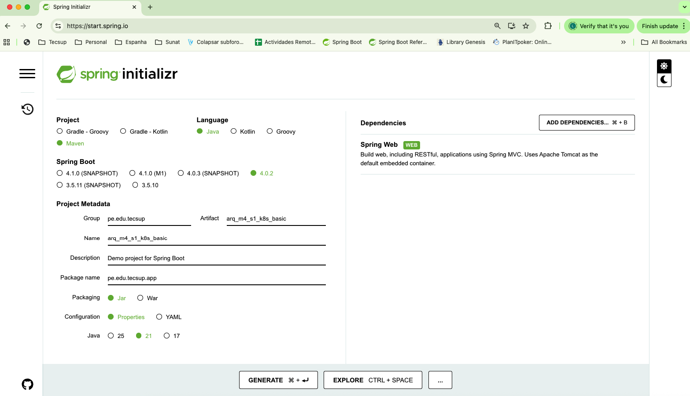

# Introducción a Kubernate

### 1.- Activar Kubernetes en Docker Desktop


- Verificar que el cluster de Kubernetes esté corriendo

```bash
kubectl cluster-info
```

### 2.- Tener una aplicación básica



### 3.- Compilar la app generando el archivo .jar

```bash
mvn  clean package -DskipTests
```

### 4.- Crear el archivo Dockerfile

```dockerfile
# Dockerfile
FROM eclipse-temurin:21-jre-alpine
WORKDIR /app
COPY target/*.jar app.jar
EXPOSE 8080
ENTRYPOINT ["java", "-jar", "app.jar"]
```

### 5.- Construir la imagen Docker

```bash
docker build -t app-k8s-local:1.0 .
```
### 6.- Probar la imagen localmente

```bash
docker run -p 8080:8080 app-k8s-local:1.0
```
- Probar en el navegador: http://localhost:30080


## KUBERNETES

### 7.- Desplegar un POD en Kubernetes
- Crear el archivo de configuración del POD ( k8s/deployment-v1.yaml)

```yaml
apiVersion: apps/v1
kind: Deployment  # Tipo de recurso: Deployment 
metadata:
  name: app-k8s
spec:
  replicas: 1                     # Solo 1 pod por ahora
  selector:
    matchLabels:
      app: app-k8s
  template:
    metadata:
      labels:
        app: app-k8s
    spec:
      containers:
        - name: app-k8s
          image: app-k8s-local:1.0
          imagePullPolicy: Never     # Usar imagen local
          ports:
            - containerPort: 8080
```

Desplegar el POD en Kubernetes

```
kubectl apply -f k8s/deployment-v1.yaml
```
Ver los Pods corriendo

```
kubectl get pods
```
Ver los logs del POD

``` 
kubectl logs -f <NOMBRE_DEL_POD>
``` 

### 8.- Exponer el POD con un Service
- Crear el archivo de configuración del Service ( k8s/service-v1.yaml)

``` 
apiVersion: v1
kind: Service
metadata:
  name: lab-service
spec:
  type: NodePort
  selector:
    app: app-k8s                  # Conecta con pods que tengan esta etiqueta
  ports:
    - port: 80                      # Puerto del Service
      targetPort: 8080              # Puerto del contenedor
      nodePort: 30080               # Puerto en localhost
```
Desplegar el Service en Kubernetes
```
kubectl apply -f k8s/service-v1.yaml
```
Ver los Services corriendo
```
kubectl get services
```
Probar en el navegador: http://localhost:30080

### 9.- Aumentar la cantidad de replicas

Modificar el Controller

```
package pe.edu.tecsup.app.controllers;

import org.springframework.web.bind.annotation.GetMapping;
import org.springframework.web.bind.annotation.RestController;

import java.net.InetAddress;
import java.net.UnknownHostException;

@RestController
public class K8sController {

    private int contador = 0;

    @GetMapping("/")
    public String hello() throws UnknownHostException {

        contador++;
        String hostname = InetAddress.getLocalHost().getHostName();
        
        return String.format("Versión 1 => Pod = %s , Visitas = %d  ", hostname, contador);
    }

}
```
Volver a generar el docker con la nueva versión de la app

```bash
mvn  clean package -DskipTests

docker build -t app-k8s-local:2.0 .

```

Crear un nuevo Deployment modificando el archivo k8s/deployment-v2.yaml

```
spec:
replicas: 3                     # Solo 1 pod por ahora
```

Desplegar el nuevo Deployment

```
kubectl apply -f k8s/deployment-v2.yaml

kubectl get pods

```

Realizar varias peticiones

```
for i in {1..20}; do curl http://localhost:30080; echo ""; done
```

Pruebas : Eliminar un POD y ver como se vuelve a recrear

```
kubectl get pods    
kubectl delete pod <NOMBRE_DEL_POD>
kubectl get pods
```
### 9.- Agregar Health Check al Deployment

Modificar el Controller
```
package pe.edu.tecsup.app.controllers;

import org.springframework.web.bind.annotation.GetMapping;
import org.springframework.web.bind.annotation.RestController;

import java.net.InetAddress;
import java.net.UnknownHostException;

@RestController
public class K8sController {

    private boolean estadoSalud = true;

    private int contador = 0;

    @GetMapping("/")
    public String hello() throws UnknownHostException {

        contador++;
        String hostname = InetAddress.getLocalHost().getHostName();

        return String.format("Versión 1 => Pod = %s , Visitas = %d  ", hostname, contador);
    }

    /**
     *  Liveness: Indica si la aplicación está viva o no. Si el endpoint devuelve un estado de éxito (por ejemplo, HTTP 200), Kubernetes considerará que el contenedor está vivo. Si devuelve un error (por ejemplo, HTTP 500), Kubernetes considerará que el contenedor no está vivo y lo reiniciará.
     * @return
     */
    @GetMapping("/health/liveness")
    public String liveness() {
        return "OK";
    }

    /**
     *  Readiness: Indica si la aplicación está lista para recibir tráfico. Si el endpoint devuelve un estado de éxito, Kubernetes considerará que el contenedor está listo y comenzará a enviar tráfico a él. Si devuelve un error, Kubernetes considerará que el contenedor no está listo y no enviará tráfico a él hasta que esté listo.
     * @return
     */
     @GetMapping("/health/readiness")
     public String readiness() {
         if(estadoSalud) {
             return "OK";
         }
         throw  new RuntimeException("No estoy listo");
     }

     @GetMapping("/health/switch")
     public String switchHealth() {
         estadoSalud = !estadoSalud;
         return "Estado de salud cambiado a: " + (estadoSalud ? "OK" : "NOT OK");
     }


}


```

Volver a generar el docker con la nueva versión de la app

```bash
mvn  clean package -DskipTests

docker build -t app-k8s-local:3.0 .

```
Desplegar el nuevo Deployment

k8s/deployment-v3.yaml

```
apiVersion: apps/v1
kind: Deployment  # Tipo de recurso: Deployment
metadata:
  name: app-k8s
spec:
  replicas: 3                     # Solo 3 pod por ahora
  selector:
    matchLabels:
      app: app-k8s
  template:
    metadata:
      labels:
        app: app-k8s
    spec:
      containers:
        - name: app-k8s
          image: app-k8s-local:3.0
          imagePullPolicy: Never     # Usar imagen local
          ports:
            - containerPort: 8080

          # Health checks
          livenessProbe: ## Verifica si el contenedor está vivo
            httpGet:
              path: /health/liveness
              port: 8080
            initialDelaySeconds: 10
            periodSeconds: 5

          readinessProbe: ## Verifica si el contenedor está listo para recibir tráfico
            httpGet:
              path: /health/readiness
              port: 8080
            initialDelaySeconds: 10
            periodSeconds: 5
```

```
kubectl apply -f k8s/deployment-v3.yaml

kubectl get pods

```

### 10.- Agregar variables de entorno al Deployment

Definir las variables en k8s/configmap.yaml
```
apiVersion: v1
kind: ConfigMap
metadata:
  name: app-config
data:
    APP_NAME : "production"
    APP_ENV : "kubernetes"
    APP_VERSION : "3.0"
```
Crear un nuevo deployment considerando las nuevas variables  en k8s/deployment-v4.yaml
```
....
          # Definir variables de entorno desde ConfigMap
          env:
            - name: APP_NAME
              valueFrom:
                configMapKeyRef:
                  name: app-config
                  key: APP_NAME
            - name: APP_ENV
              valueFrom:
                configMapKeyRef:
                  name: app-config
                  key: APP_ENV
            - name: APP_VERSION
              valueFrom:
                configMapKeyRef:
                  name: app-config
                  key: APP_VERSION
                  
...
```

```
mvn  clean package -DskipTests

docker build -t app-k8s-local:4.0 .

kubectl apply -f k8s/configmap.yaml

kubectl apply -f k8s/deployment-v4.yaml

kubectl get pods

```

- Probar en el navegador: http://localhost:30080
